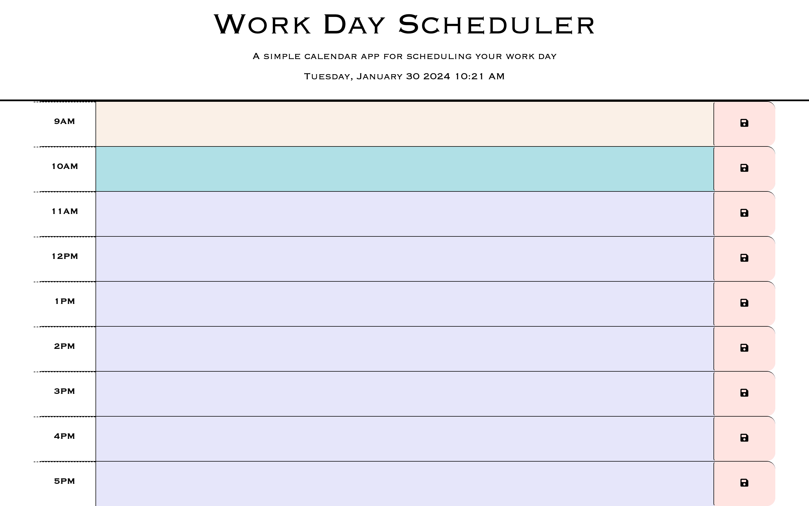

# Work-Day-Scheduler

## Description
The user can use the work day schedule to write any tasks they need to do during each hour period. The schedule is from 9am-5pm. It’s color coded to let the user know if it’s in the present, past and future time. 

## Features 
* The current date and time is display.
* Each time block is color-coded to indicate whether it's the past, present or future.
    *  Past
    *  Present
    *  Future
* Enter tasks in each time-block.
* Save the task.

## Website Preview

## Link Deploy Application

[Deploy Application](https://jjimenez174.github.io/Work-Day-Scheduler/)